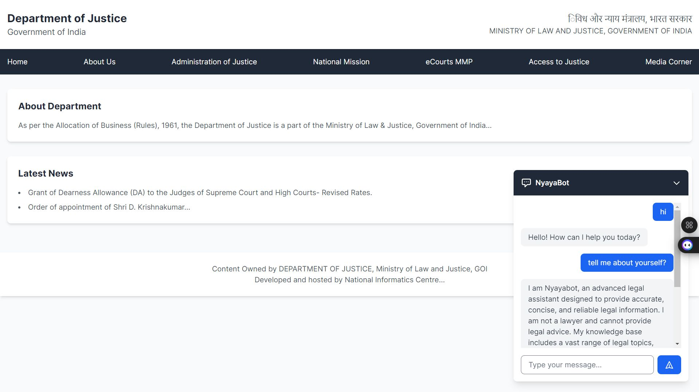

# NyayaBot – AI-Powered Legal Chatbot

NyayaBot is an AI-powered legal chatbot designed to provide quick, accessible, and reliable guidance on Indian law. The system interprets complex legal queries and delivers real-time responses using Natural Language Processing (NLP) and AI-based response generation.

NyayaBot aims to reduce reliance on traditional legal consultation systems that are often time-consuming and costly by providing instant, structured legal insights.

---

## Table of Contents

- Overview  
- Key Features  
- System Architecture  
- Tech Stack  
- Installation  
- Usage  
- Project Structure  
- Achievements  
- Future Enhancements  
- Contributing  
- License  

---

## Overview

Legal information can be complex and difficult for the general public to interpret. NyayaBot simplifies access to Indian legal knowledge by:

- Understanding natural language legal queries  
- Processing structured legal datasets  
- Generating AI-driven responses  
- Delivering instant legal insights through a conversational interface  

The chatbot is trained on a structured dataset containing 3,000+ columns to capture detailed legal nuances and improve response precision.

---

## Key Features

- AI-driven chatbot for legal query resolution  
- Trained on a large legal dataset (3,000+ columns)  
- NLP-based query understanding  
- AI-powered response generation  
- Real-time legal assistance  
- User-friendly web interface  
- Achieved 90% accuracy in resolving legal queries  

---

## Achievements

- Secured first position in a college-level hackathon  
- Advanced to zonal-level competition  
- Demonstrated high-accuracy legal query resolution system  

---

## System Architecture


User Interface (Web Browser)
↓
Flask Backend Server
↓
LangChain Processing Layer
↓
Gemini API Integration
↓
AI-Generated Legal Response


The backend processes user queries, applies NLP techniques, and integrates with the Gemini API to generate contextual legal responses.

---

## Tech Stack

### Programming Language
- Python

### Frameworks & Libraries
- Flask
- Pandas
- Scikit-Learn
- LangChain

### AI & API
- Gemini API
- NLP-based response generation

### Deployment
- Flask-based backend with API integration

---

## Installation

### Prerequisites

- Python 3.8 or higher

---

### Steps

#### 1. Clone the Repository

```bash
git clone https://github.com/Prathmesh1703/NyayaBot.git
cd NyayaBot
2. Install Dependencies
pip install -r requirements.txt
3. Run the Application
python app.py
4. Access the Application

Open your browser and navigate to:

http://localhost:5000
Usage

Enter your legal query into the chatbot interface.

The system processes the query using NLP techniques.

AI generates a structured response based on Indian law.

Refine your query if needed for more specific insights.

Project Structure
NyayaBot/
│
├── app.py
├── models/
├── data/
├── templates/
├── static/
├── requirements.txt
└── README.md
Future Enhancements

Multilingual support for wider accessibility

Integration with official legal databases

Voice query support

Mobile application development

Enhanced contextual legal reasoning

Contributing

Contributions are welcome.

Fork the repository

Create a feature branch

Commit your changes

Push to your fork

Submit a Pull Request

For major changes, open an issue to discuss proposed improvements.

License

This project is open-source and available under the MIT License.
